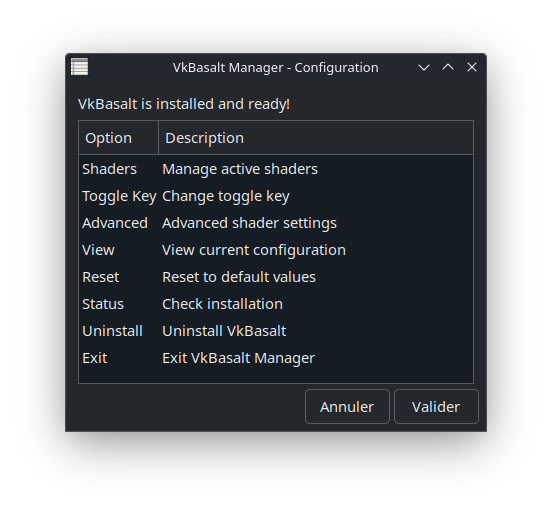
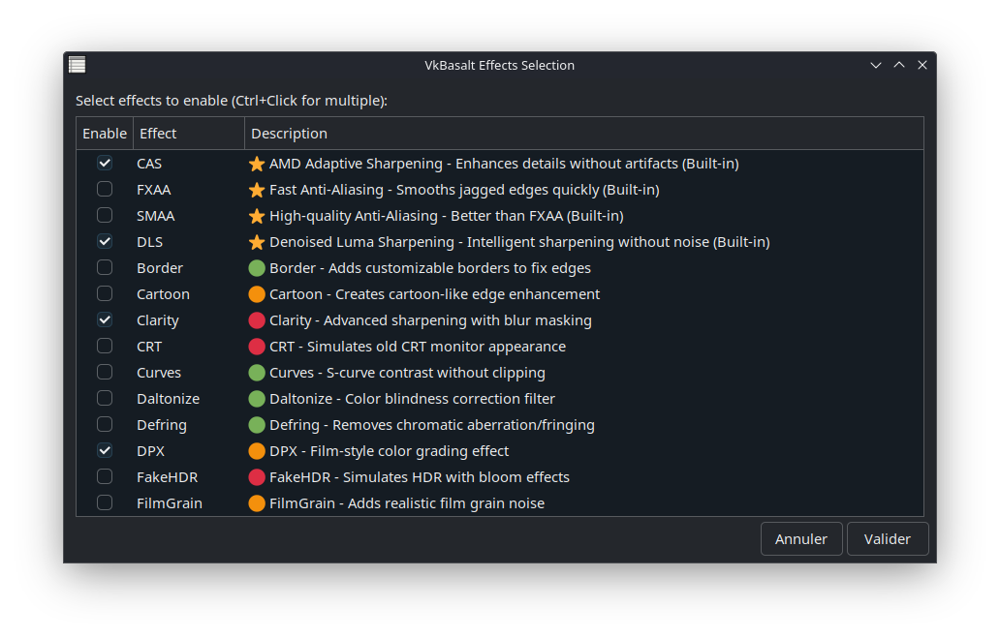
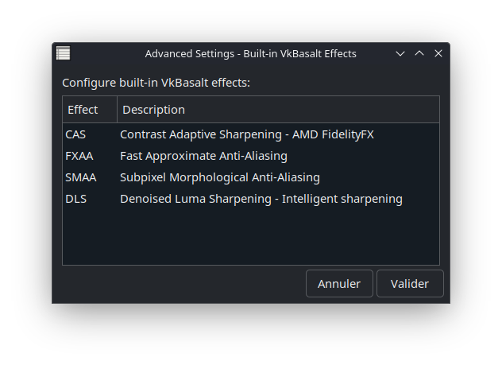

# VkBasalt Manager - Installation & Configuration Tool

A comprehensive graphical interface for installing, configuring, and managing VkBasalt post-processing effects on Linux gaming systems. This tool provides an easy-to-use solution for enhancing your gaming visuals with minimal performance impact.

## 🎯 Overview

VkBasalt Manager simplifies the installation and configuration of VkBasalt, a Vulkan post-processing layer that applies real-time visual effects to games. The manager includes automated installation, shader management, advanced configuration options, and **Lossless Scaling Frame Generation** setup through an intuitive graphical interface.

## Main Configuration Menu
*The main interface showing configuration options including shader management, toggle key settings, Lossless Scaling configuration, and advanced controls.*


## Shader Selection Interface
*Interactive shader selection with performance impact indicators and detailed descriptions for each effect.*


## Advanced Settings Panel
*Fine-tuning controls for built-in VkBasalt effects including CAS, FXAA, SMAA, and DLS with real-time parameter adjustment.*


## 🚀 Supported Systems

### 🎮 Steam Deck (SteamOS)
- **Script**: `vkbasalt_manager_steamos.sh`
- **Features**: Steam Deck optimized installation from Chaotic AUR
- **Automatic**: Dependency management, VkBasalt installation, shader setup
- **Integration**: Desktop icon creation for easy access
- **Steam Integration**: Automatic Steam launch options configuration

### 🏔️ CachyOS 
- **Script**: `vkbasalt_manager_cachyos.sh`  
- **Features**: Native Paru package manager support
- **Sources**: Official repositories with AUR fallback
- **Optimization**: CachyOS-specific performance tuning

## ⚡ Quick Start

### 1. Download and Prepare
```bash
# Download the appropriate script for your system
wget https://github.com/Vaddum/vkbasalt-manager/raw/main/vkbasalt_manager_steamos.sh
# OR
wget https://github.com/Vaddum/vkbasalt-manager/raw/main/vkbasalt_manager_cachyos.sh

# Make executable
chmod +x vkbasalt_manager_*.sh
```

### 2. Run Installation
```bash
# Steam Deck / SteamOS
./vkbasalt_manager_steamos.sh

# CachyOS
./vkbasalt_manager_cachyos.sh
```

### 3. Follow the Wizard
The graphical installer will:
- ✅ Check system compatibility
- 📦 Install dependencies automatically  
- 🔧 Download and configure VkBasalt
- 🎨 Install ReShade shader collection
- 🖥️ Create desktop shortcuts
- 🎮 Configure Steam integration

## 🎨 Available Effects

### ⭐ Built-in VkBasalt Effects (Always Available)
| Effect | Description | Performance |
|--------|-------------|-------------|
| **CAS** | AMD FidelityFX Contrast Adaptive Sharpening | Low |
| **FXAA** | Fast Approximate Anti-Aliasing | Low |
| **SMAA** | Subpixel Morphological Anti-Aliasing | Medium |
| **DLS** | Denoised Luma Sharpening | Low |

### 🌟 ReShade Effects Collection
| Effect | Description | Performance Impact |
|--------|-------------|-------------------|
| **4xBRZ** | Advanced pixel art upscaling for retro games | 🔴 High |
| **AdaptiveSharpen** | Smart edge-aware sharpening | 🟠 Medium |
| **Border** | Customizable screen borders | 🟢 Low |
| **Cartoon** | Cartoon-style edge enhancement | 🟠 Medium |
| **Clarity** | Advanced sharpening with blur masking | 🔴 High |
| **CRT** | Classic CRT monitor simulation | 🔴 High |
| **Curves** | S-curve contrast enhancement | 🟢 Low |
| **Daltonize** | Color blindness correction | 🟢 Low |
| **DPX** | Professional film-style color grading | 🟠 Medium |
| **FakeHDR** | HDR simulation with bloom effects | 🔴 High |
| **FilmGrain** | Realistic film grain texture | 🟠 Medium |
| **Levels** | Black/white point adjustments | 🟢 Low |
| **LiftGammaGain** | Professional color grading tool | 🟢 Low |
| **LumaSharpen** | Luminance-based detail enhancement | 🟠 Medium |
| **Monochrome** | Black & white with film presets | 🟢 Low |
| **Nostalgia** | Retro gaming visual styles | 🟠 Medium |
| **Sepia** | Vintage sepia tone effect | 🟢 Low |
| **SmartSharp** | Depth-aware intelligent sharpening | 🔴 High |
| **Technicolor** | Classic vibrant film look | 🟢 Low |
| **Tonemap** | Advanced tone mapping controls | 🟢 Low |
| **Vibrance** | Smart saturation enhancement | 🟢 Low |
| **Vignette** | Camera lens edge darkening | 🟠 Medium |

## 🚀 Lossless Scaling Frame Generation

### What is Lossless Scaling Frame Generation (LSFG)?
Lossless Scaling Frame Generation is an advanced technology that interpolates additional frames between existing frames to increase perceived framerate and smoothness. This feature is particularly beneficial for games with lower framerates or when you want to achieve ultra-smooth gameplay.

### ⚙️ Features
- **Automatic Steam Integration**: Automatically applies launch options to selected games
- **Intelligent Game Detection**: Scans your Steam library for compatible games
- **Precision Configuration**: 2-decimal precision for flow scale adjustments
- **Multiple Scaling Modes**: Support for 1x, 2x, 3x, and 4x scaling multipliers
- **Performance Optimization**: Built-in performance mode for better framerates
- **Backup & Restore**: Automatic backup of Steam configurations

### 📋 Configuration Options

#### Basic Settings
- **Enable/Disable**: Simple toggle for LSFG functionality
- **Auto-Apply**: Automatically applies settings to Steam launch options
- **Game Selection**: Choose specific games from your Steam library

#### Advanced Parameters
| Parameter | Description | Range | Default |
|-----------|-------------|--------|---------|
| **LSFG_MULTIPLIER** | Frame scaling multiplier | 1-4 | 2 |
| **LSFG_FLOW_SCALE** | Motion smoothness control | 0.10-1.00 | 0.50 |
| **LSFG_PERF_MODE** | Performance optimization | 0-1 | 1 |

### 🎮 Usage Guide

#### Quick Setup (Recommended)
1. Launch VkBasalt Manager
2. Select "Lossless Scaling"
3. Choose your game from the Steam library
4. Select "Enable" for automatic configuration
5. Restart Steam for changes to take effect

#### Custom Configuration
1. Select "Custom" instead of "Enable"
2. Choose your preferred multiplier (2x recommended)
3. Adjust flow scale for motion smoothness
4. Toggle performance mode as needed
5. Settings are automatically applied to Steam

#### Manual Configuration
If automatic configuration fails, you can manually add these launch options in Steam:

**Basic Setup:**
```
ENABLE_LSFG=1 LSFG_MULTIPLIER=2 LSFG_FLOW_SCALE=0.50 LSFG_PERF_MODE=1 %COMMAND%
```

**Ultra Smooth (for high motion games):**
```
ENABLE_LSFG=1 LSFG_MULTIPLIER=2 LSFG_FLOW_SCALE=0.25 LSFG_PERF_MODE=1 %COMMAND%
```

**Responsive (for competitive games):**
```
ENABLE_LSFG=1 LSFG_MULTIPLIER=2 LSFG_FLOW_SCALE=0.80 LSFG_PERF_MODE=1 %COMMAND%
```

### 🔧 Steam Integration Features

#### Automatic Configuration
- **Game Detection**: Automatically scans Steam library and installed games
- **Launch Options Management**: Modifies Steam's localconfig.vdf safely
- **Backup System**: Creates automatic backups before making changes
- **Verification**: Confirms changes were applied correctly

#### Smart Configuration Management
- **Conflict Resolution**: Safely removes existing LSFG options before adding new ones
- **Preservation**: Keeps other launch options intact
- **Error Recovery**: Automatic rollback on configuration failures

#### Steam Deck Optimization
- **Multiple Steam Locations**: Supports native Steam, Flatpak, and various Steam Deck configurations
- **Permission Handling**: Automatically manages file permissions
- **User Detection**: Intelligent Steam user ID detection
- **Configuration Diagnosis**: Advanced troubleshooting for Steam configuration issues

### ⚠️ Important Notes

- **Prerequisites**: Lossless Scaling software must be installed separately
- **Compatibility**: Not all games support frame generation
- **Performance Impact**: Higher multipliers may affect performance
- **Steam Restart**: Always restart Steam after configuration changes
- **Testing Recommended**: Test settings per game for optimal results

### 🛠️ Troubleshooting Lossless Scaling

#### Common Issues

**Steam configuration not accessible:**
1. Close Steam completely
2. Run the manager as the 'deck' user
3. Ensure Steam has been launched at least once
4. Check file permissions in ~/.steam/

**Automatic configuration fails:**
1. Use the manual configuration method
2. Check if Steam is running (close if needed)
3. Verify Python3 is installed
4. Try the "View" option to check current settings

**Frame generation not working:**
1. Ensure Lossless Scaling is properly installed
2. Verify the game uses compatible graphics APIs
3. Check if the game is launched through Steam
4. Test with different LSFG_MULTIPLIER values

**Performance issues:**
1. Reduce LSFG_MULTIPLIER to 2 or 1
2. Increase LSFG_FLOW_SCALE for more responsive feel
3. Ensure LSFG_PERF_MODE is set to 1
4. Monitor system resources during gameplay

## ⚙️ Advanced Configuration

### Built-in Effect Tuning

#### CAS (Contrast Adaptive Sharpening)
- **Sharpness**: 0.0 to 1.0 (default: 0.5)
- Enhances image details without introducing artifacts
- AMD FidelityFX technology for optimal quality

#### FXAA (Fast Approximate Anti-Aliasing)  
- **Subpixel Quality**: 0.0 to 1.0 (default: 0.75)
- **Edge Threshold**: 0.063 to 0.333 (default: 0.125)
- Balances performance and anti-aliasing quality

#### SMAA (Subpixel Morphological Anti-Aliasing)
- **Edge Detection**: luma, color, or depth (default: luma)
- **Threshold**: 0.01 to 0.20 (default: 0.05)  
- **Max Search Steps**: 8 to 64 (default: 32)
- Superior quality compared to FXAA

#### DLS (Denoised Luma Sharpening)
- **Sharpening**: 0.0 to 1.0 (default: 0.5)
- **Denoise**: 0.0 to 1.0 (default: 0.20)
- Intelligent sharpening with noise reduction

### Toggle Key Configuration
Customize the in-game toggle key from a comprehensive list:
- **Default**: Home key
- **Function Keys**: F1-F12
- **Navigation**: Page Up/Down, Insert, Delete
- **System**: Print Screen, Scroll Lock, Pause
- **Modifiers**: Caps Lock, Num Lock, Tab

## 📁 File Structure

```
~/.config/vkBasalt/
├── vkBasalt.conf              # Main configuration file
├── vkbasalt-manager.sh        # Manager script
└── vkbasalt-manager.svg       # Application icon

~/.config/reshade/
├── Shaders/                   # ReShade effect files (.fx)
└── Textures/                  # Texture resources

~/.local/lib/
├── libvkbasalt.so             # VkBasalt library (64-bit)
└── lib32/libvkbasalt.so       # VkBasalt library (32-bit)

~/.local/share/vulkan/implicit_layer.d/
├── vkBasalt.json              # Vulkan layer config (64-bit)
└── vkBasalt.x86.json          # Vulkan layer config (32-bit)

# Steam Configuration Files (automatically managed)
~/.steam/steam/userdata/[USER_ID]/config/
└── localconfig.vdf            # Steam launch options (auto-backup created)
```

### In-Game Controls
- **Toggle Effects**: Press the configured toggle key (default: Home)
- **Real-time**: Effects can be enabled/disabled during gameplay
- **No Restart**: Changes apply immediately without restarting the game

## 🔧 Management Features

### Main Interface Options
- **Shaders**: Enable/disable effects with visual feedback
- **Toggle Key**: Customize the in-game activation key
- **Advanced**: Fine-tune built-in effect parameters
- **Lossless Scaling**: Configure frame generation for Steam games
- **View**: Inspect current configuration settings
- **Reset**: Restore default configurations
- **Status**: Check installation and component status
- **Uninstall**: Complete removal of all components

### Automatic Features
- **Dependency Detection**: Automatically installs required packages
- **Shader Organization**: Categorizes effects by performance impact
- **Configuration Validation**: Ensures proper syntax and compatibility
- **Desktop Integration**: Creates application menu entries and shortcuts
- **Steam Integration**: Automatic Steam launch options management
- **Backup System**: Automatic configuration backups before changes

## 🛠️ Troubleshooting

### Common Issues

**VkBasalt not working in games:**
1. Verify the game uses Vulkan API (not OpenGL/DirectX)
2. Use "Status" option in manager to verify installation
3. Ensure the toggle key is pressed to activate effects

**Effects not visible:**
1. Press the toggle key (default: Home) in-game
2. Verify effects are enabled in shader selection
3. Check configuration file syntax in "View" option
4. Try resetting to default configuration

**Performance issues:**
1. Disable high-impact effects (marked with 🔴)
2. Use only built-in effects for maximum performance
3. Reduce effect intensity in advanced settings
4. Monitor frame rate and adjust accordingly

**Installation problems:**
1. Check internet connection for downloads
2. Verify user permissions in home directory
3. Ensure sufficient disk space (minimum 100MB)
4. Check package manager configuration

**Steam configuration issues:**
1. Ensure Steam is completely closed before configuration
2. Verify you're running as the correct user ('deck' on Steam Deck)
3. Check that Steam has been launched at least once
4. Use the diagnostic features in the manager

**Lossless Scaling not working:**
1. Verify Lossless Scaling is installed separately
2. Check that Steam launch options were applied correctly
3. Ensure the game is launched through Steam
4. Try different LSFG parameters for your specific game

### Getting Support
1. **Status Check**: Use the "Status" option for system information
2. **Configuration Review**: Use "View" to check current settings  
3. **Reset Configuration**: Use "Reset" to restore working defaults
4. **Steam Diagnosis**: Use the automatic Steam diagnostic features
5. **Clean Reinstall**: Use "Uninstall" then reinstall if needed

## 🗑️ Uninstallation

### Complete Removal
The manager provides thorough uninstallation:
1. Launch VkBasalt Manager
2. Select "Uninstall" option
3. Confirm removal (⚠️ This removes everything)
4. All files, configurations, and dependencies are removed
5. Steam launch options are automatically cleaned up

### Manual Removal (if needed)
```bash
# Remove all VkBasalt components
rm -rf ~/.config/vkBasalt ~/.config/reshade
rm -f ~/.local/lib/libvkbasalt.so ~/.local/lib32/libvkbasalt.so
rm -f ~/.local/share/vulkan/implicit_layer.d/vkBasalt*.json
rm -f ~/Desktop/VkBasalt-Manager.desktop

# Remove Steam configuration backups (optional)
rm -f ~/.steam/steam/userdata/*/config/localconfig.vdf.backup.*
```

## 📋 System Requirements

### Minimum Requirements
- **OS**: Linux (Arch-based distributions)
- **Graphics**: Vulkan-compatible GPU and drivers
- **Memory**: 2GB available RAM
- **Storage**: 100MB free space
- **Network**: Internet connection for initial setup
- **Python**: Python3 for automatic Steam configuration

### Recommended
- **GPU**: Dedicated graphics card with recent Vulkan drivers
- **Memory**: 4GB+ RAM for shader compilation
- **Storage**: 500MB+ for expanded shader collections
- **CPU**: Multi-core processor for real-time processing
- **Steam**: Steam client for Lossless Scaling integration

### For Lossless Scaling
- **Software**: Lossless Scaling application (purchased separately)
- **Steam**: Steam client with valid library
- **Performance**: Sufficient GPU/CPU for frame generation overhead

## 🤝 Contributing

Contributions are welcome! Areas for improvement:
- Additional Linux distribution support
- New shader effects and presets
- Performance optimizations
- User interface enhancements
- Documentation improvements
- Steam integration enhancements
- Lossless Scaling compatibility improvements

## 📄 License

This project respects all component licenses:
- **VkBasalt**: Individual project license
- **ReShade Shaders**: Various open-source licenses
- **Manager Scripts**: Open source with attribution requirements
- **Lossless Scaling**: Commercial software (not included)

## 🙏 Acknowledgments

- **VkBasalt Project**: Core post-processing layer
- **ReShade Community**: Extensive shader effect library  
- **Chaotic AUR**: Package distribution for Arch Linux
- **AMD FidelityFX**: CAS (Contrast Adaptive Sharpening) technology
- **Linux Gaming Community**: Testing and feedback
- **Lossless Scaling**: Frame generation technology
- **Steam**: Platform integration and game library support

## 🔗 Useful Links

- [VkBasalt Official Repository](https://github.com/DadSchoorse/vkBasalt)
- [ReShade Shader Database](https://reshade.me/)
- [Lossless Scaling on Steam](https://store.steampowered.com/app/993090/Lossless_Scaling/)
- [Vulkan API Documentation](https://www.vulkan.org/)
- [ProtonDB (Steam Play Compatibility)](https://www.protondb.com/)
- [Steam Deck Gaming](https://store.steampowered.com/steamdeck)
